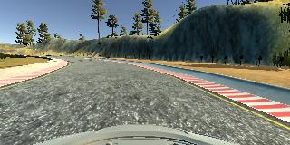
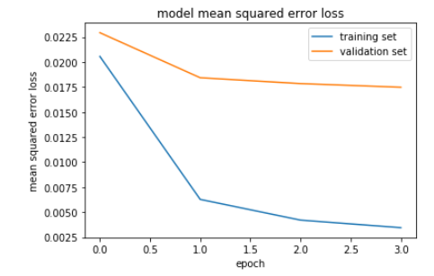

# **Behavioral Cloning** 

## Writeup Template

**Behavioral Cloning Project**

The goals / steps of this project are the following:
* Use the simulator to collect data of good driving behavior
* Build, a convolution neural network in Keras that predicts steering angles from images
* Train and validate the model with a training and validation set
* Test that the model successfully drives around track one without leaving the road
* Summarize the results with a written report

---
### Files Submitted & Code Quality

The project includes the following files:
* Model.ipynb containing the script to create and train the model
* model.py the *.py* version of *Model.ipynb*
* drive.py for driving the car in autonomous mode
* model.h5 containing the model architecture and network weights
* writeup.md summarizing the results
* video.mp4 video file showing results

Using the simulator and the drive.py file, the car can be driven autonomously around the track by executing 
```sh
python drive.py model.h5
```

The model.py file contains the code for training and saving the convolution neural network. The file shows the pipeline I used for training and validating the model, and it contains comments to explain how the code works.

### Model Architecture and Training Strategy

#### Data Description

The data consists of steering angles and car front vision images. Here is an example image of center lane driving image:



#### Architecture

The first step was to crop the top 35px and the bottom 15px from the image. These areas contain information irrelevant for driving.

The captured data was then preprocessed by transforming the RGB values from 0~255 range to -1.0~1.0 range, using a Keras lambda layer. This keeps the mean at 0 which is ideal for neural networks. 

Finally, data passes through the actual network, implemented as follows:

CONV: kernel 5x5, 24 filters

CONV: kernel 5x5, 36 filters

CONV: kernel 3x3, 64 filters

CONV: kernel 3x3, 64 filters

DROPOUT: 0.35 retention

FC: 100 neurons

FC: 50 neurons

FC: 1 neuron 

Note the 1 neuron output, because we want to predict steering angle. Also, there is no softmax activation in the output because this is not a classification task, and the output could go over 1 or -1. 

#### Reduce Overfitting

The dropout layers help reduce overfitting (model.py lines 98). 

Also, the model was trained and validated on different data sets to ensure that the model was not overfitting (code line 29). The model was tested by running it through the simulator and ensuring that the vehicle could stay on the track. 

Another strategy to reduce overfitting is to augment the data. In this case, the images were flipped horizontally and added with the inverted steering angle. This ensures the model isn't biased towards left or right turns, while doubling the sample size. 

#### Parameter Tunning

The model used an adam optimizer, so the learning rate was not tuned manually (model.py line 103). Learning rate was set to 0.0005, and other parameters were kept default. Epochs was set to 4 since validation loss didn't seem to improve after around 3 epochs. 

#### Training Data

Training data was chosen to keep the vehicle driving on the road. I used a combination of center lane driving, recovering from the left and right sides of the road, and special cases where the vehicle did not behave as expected. (see more details in next section).

The collected data was randomly shuffled and split into test and train sets, given 20% of data for validation. 

After the collection process, there were about 7000 data samples. 

#### Training process and Validation

The overall loss was low and decreasing at each epoch on both train and test, hovering around 0.005 to 0.2. Bellow is a graph of the train and validation loss over 4 epochs in one of the trainings. 



This visualization helps to see if the model is underfitting (high training loss) or overfitting (low training loss but high validation loss). 

In most cases the vehicle was able to stay on the road, however certain spots made the car drift off the lane and crash. The approach taken was to record more data in those spots, as well as recording recovery action data. Bellow the *.gif* shows an example of a recovery action being recorded, where the car was about to leave the road, and it took a strong turn left. 


Capturing data of these specific instances helped train the model to act better on special scenarios. 

At the end of the process, the vehicle is able to drive autonomously around the track without leaving the road.

